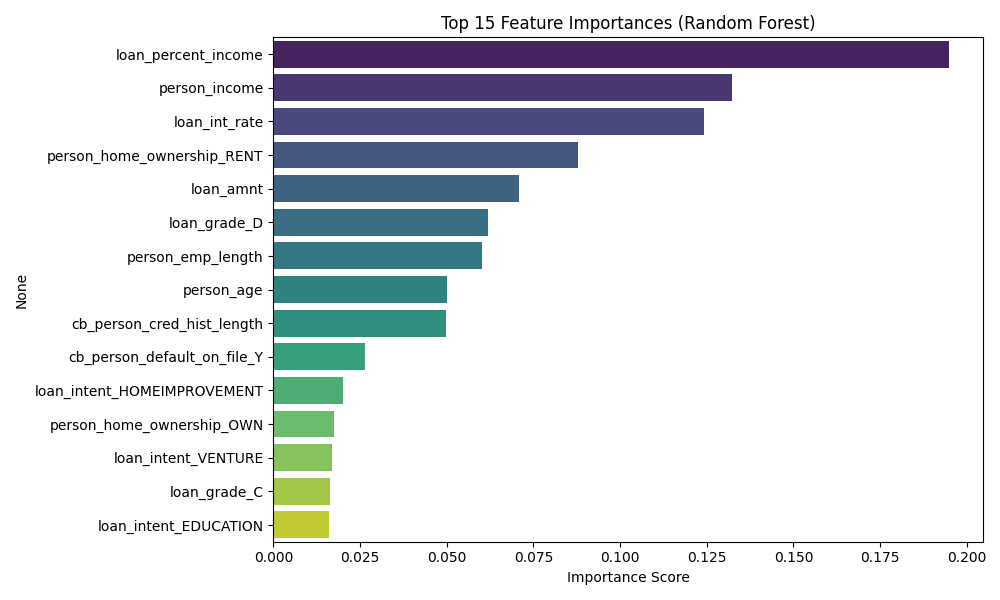

# **Credit Risk Analysis and Default Prediction**

## **Table of Contents**

- [Introduction](#introduction)
- [Dataset Overview](#dataset-overview)
- [Exploratory Data Analysis (EDA)](#exploratory-data-analysis-eda)
- [Data Preprocessing](#data-preprocessing)
- [Modeling](#modeling)
- [Model Interpretability](#model-interpretability)
- [Prediction Module](#prediction-module)
- [Conclusion](#conclusion)

## **Introduction**

In this project, a comprehensive credit risk analysis was conducted using borrower-level data to understand the patterns behind loan defaults. By identifying key factors that contribute to credit default, the aim is to enhance decision-making in lending processes. The project includes detailed exploratory analysis, machine learning modeling, a real-time prediction function, and an interactive Tableau dashboard.

## **Dataset Overview**

The dataset used for this project is sourced from Kaggle and can be found at the following link: [Credit Risk Dataset on Kaggle](https://www.kaggle.com/datasets/laotse/credit-risk-dataset)

- **Total Records:** 32,581  
- **Total Features:** 12  
- **Target Variable:** `loan_status` (0 = Non-default, 1 = Default)

This dataset provides information relevant to assessing the credit risk of loan applicants. Below is a detailed description of the features included:

| **Feature Name**             | **Description**                            |
| ---------------------------- | ------------------------------------------ |
| `person_age`                 | Age of the individual                      |
| `person_income`              | Annual income                              |
| `person_home_ownership`      | Type of home ownership                     |
| `person_emp_length`          | Employment length in years                 |
| `loan_intent`                | Purpose or intent of the loan              |
| `loan_grade`                 | Loan grade assigned                        |
| `loan_amnt`                  | Amount of the loan requested               |
| `loan_int_rate`              | Interest rate of the loan                  |
| `loan_status`                | Loan status (0 = non-default, 1 = default) |
| `loan_percent_income`        | Loan amount as a percentage of income      |
| `cb_person_default_on_file`  | Historical record of default (Yes/No)      |
| `cb_preson_cred_hist_length` | Length of credit history in years          |

## **Exploratory Data Analysis (EDA)**

During the EDA phase, the structure, quality, and insights of the dataset was explored. Here are some key findings:

### **Missing Values:**
- **`loan_int_rate`** has 9.56% missing data.
- **`person_emp_length`** has 2.75% missing data.
- All other columns are complete with no missing values.

### **Personal and Financial Information**
- **Age:** Average age is around **27.7 years**, with a minimum of **20** and a maximum of **144**, suggesting potential outliers.
- **Income:** Some individuals report incomes up to **$6,000,000**, indicating possible extreme values or anomalies.
- **Loan Amount:** Most loans are around **$8,000**, with the highest being **$35,000**.
- **Interest Rate:** Average loan interest rate is **11.01%**, ranging from **5.42%** to **23.22%**.

### **Loan Status**


- **`loan_status`** shows whether a borrower defaulted:

    - **Non-defaulted loans (0):** 25,473

    - **Defaulted loans (1):** 7,108

    - **Default Rate: 21.82%** of loans ended in default, indicating a moderate class imbalance.

### **Loan Grade, Intent, Home Ownership, and Historical record of default Distributions**


- **`person_home_ownership`:** Majority of borrowers rent (16,446 = 50.5%) or are paying a mortgage (13,444 = 41.3%), which might correlate with financial flexibility or risk level.

- **`loan_intent`:** Education, medical needs, and venture funding are the top reasons for borrowing. Loans taken for debt consolidation and home improvement are less frequent but could signal different financial behavior or risk.

- **`loan_grade`:** Most loans are graded A or B, indicating relatively low-risk borrowers. Very few loans fall into high-risk categories F or G, which could have high default rates.

- **`cb_person_default_on_file`:** Around 17.6% of borrowers have previously defaulted. This is an important feature for predicting credit risk, especially when combined with current loan performance.

### **Default Rates by Loan Grade, Intent, and Home Ownership**


- **By Loan Grade:**:

    - Strong positive correlation between loan grade and default rate
    - Grade A: 9.96% default rate
    - Grade G: 98.44% default rate (extremely risky)

- **By Loan Intent:**

    - Debt Consolidation (28.59%) and Medical (26.70%) show **higher default rates**
    - Venture and Education show lower **default risks**

- **By Home Ownership:**
    - **Rent:** Borrowers who rent their homes have the highest default rate at 31.57%, indicating a potentially higher credit risk.

    - **Other:** Individuals with less common ownership types also exhibit a high default rate of 30.84%, suggesting financial instability or irregular housing situations.

    - **Mortgage:** Borrowers with a mortgage show a moderate default rate of 12.57%, which may reflect a more stable financial standing compared to renters.

    - **Own:** The lowest default rate is observed among those who own their homes outright at 7.47%, indicating the strongest financial reliability in this group.

### **Correlation**

| Variable Pair                               | Correlation Insight                                               |
| ------------------------------------------- | ----------------------------------------------------------------- |
| `loan_status` & `loan_int_rate`             | **0.34** → Higher interest rates are linked to more defaults      |
| `loan_status` & `loan_percent_income`       | **0.38** → Higher loan burden increases the likelihood of default |
| `loan_status` & `person_income`             | **-0.14** → Higher income reduces default risk                    |
| `cb_person_cred_hist_length` & `person_age` | **0.86** → Older people tend to have longer credit histories      |

## **Data Preprocessing**

To ensure the dataset was clean and suitable for modeling, the following preprocessing steps were applied:

- **Missing Values Handling:**
    - Filled missing values in `person_emp_length` using the **median**.
    - Filled missing values in `loan_int_rate` using the **mean**.

- **Outlier Treatment:**
    - Applied **winsorization** to limit extreme values in `person_income`, `loan_amnt`, and `loan_percent_income` by capping the top and bottom 1% of values.

- **Categorical Encoding:**
    - Performed **One-Hot Encoding** on key categorical variables including:
        - `person_home_ownership`
        - `loan_intent`
        - `loan_grade`
        - `cb_person_default_on_file`
    - This allows models to interpret categorical information numerically.

- **Feature Scaling:**

    - Used **Standard Scaling** to normalize numerical features such as:
        - Age, Income, Employment Length, Loan Amount, Interest Rate, etc.
    - This ensures all features contribute equally during model training.

- **Train-Test Split:**

    - Split the data into 80% training and 20% testing, while maintaining the original class distribution using stratification.

- **Class Imbalance Handling:**

    - The dataset had an imbalance in default vs. non-default loans.

    - Applied **SMOTE (Synthetic Minority Over-sampling Technique)** to the training set to balance the classes and improve model performance.

- **Saving Artifacts:**

    - Cleaned data, encoders, scalers, and train/test datasets were saved for reproducibility and deployment readiness.

## **Modeling**

In this phase, two classification models were developed and evaluated to predict loan default: Logistic Regression and Random Forest Classifier. Each model underwent hyperparameter tuning, evaluation using various performance metrics, and comparison based on real-world applicability for risk prediction.

1. **Logistic Regression**
    - **Best Hyperparameter:** C = 100
    - **ROC AUC Score:** 0.8761
    - **Accuracy:** 81%
    - **Precision (Class 1):** 0.55
    - **Recall (Class 1):** 0.78
    - **F1-Score (Class 1):** 0.65

    Logistic Regression performed well in identifying true defaulters (78% recall), making it useful when minimizing missed defaulters is critical. However, a lower precision (55%) suggests a higher number of false alarms (false positives), which could be costly in lending decisions.

2. **Random Forest Classifier**
    - **Best Hyperparameters:**
        ```python
        {
        'n_estimators': 200,
        'max_depth': None,
        'min_samples_split': 2,
        'min_samples_leaf': 1
        }
        ```
    - **ROC AUC Score:** 0.9312
    - **Accuracy:** 92.8%
    - **Precision (Class 1):** 0.93
    - **Recall (Class 1):** 0.73
    - **F1-Score (Class 1):** 0.82

    The Random Forest Classifier outperformed Logistic Regression in nearly every metric. It achieved a strong balance between detecting actual defaulters and avoiding false positives. With a high AUC of 0.93 and F1-score of 0.82, it demonstrates robust generalization and is better suited for deployment in high-stakes decision environments

### **Evaluation Visuals**

- **Confusion Matrices**

<p align="center">
  
  
</p>

- **ROC Curves**

    

### **Final Model Selection**

Given its superior performance across both ROC AUC and classification metrics, the Random Forest Classifier was selected as the final model for predicting loan defaults. The trained model was saved and can be used for real-time inference.

## **Model Interpretability**

Understanding how individual features influence the model's decision-making is essential, especially in high-stakes domains like credit risk assessment. To gain insight into the behavior of the **Random Forest Classifier**, we examined the **feature importance** scores derived from the trained model.

### **Top 15 Most Influential Features**

The following plot highlights the top 15 features contributing most significantly to the model's prediction of loan default risk:

<p align="center">  </p>

### **Key Insights**

- **Loan Percent Income** was the most influential feature, indicating that the proportion of loan amount to the borrower's income plays a critical role in predicting default.

- **Loan Interest Rate** and **Annual Income** also showed strong predictive power.

- **Loan Grade D** and **Loan Amount** further contributed significantly, reflecting lender-assigned credit risk tiers and the size of the loan respectively.

- Some encoded categorical variables such as **Home Ownership (RENT)** and **Loan Intent (EDUCATION, VENTURE, etc.)** were moderately important.

- As expected, one-hot encoded variables like **Home Ownership (OTHER)** had minimal impact on the model's performance.

## **Prediction Module**

After building and evaluating the models, a dedicated prediction module was created to allow real-time inference on new loan applicants. This module uses the final **Random Forest Classifier** model, along with the fitted **one-hot encoder**, **standard scaler**, and **feature column structure** from training.

### **How It Works**

The `predict_default.py` script, located in the `inference/` directory, performs the following steps:

1. **Load Pre-trained Components:**

    Loads the trained model, encoder, scaler, and feature column names from the `/models` directory.

2. **Preprocess Input:**

    A function `preprocess_input()` transforms the raw user input into the same format used during training, including:

    - One-hot encoding of categorical features
    - Scaling of numeric features
    - Column alignment and ordering

3. **Make Prediction:**

    The cleaned input is passed to the model to generate:

    - A binary prediction: `Default` or `Non-Default`
    - A probability score indicating the model's confidence in the applicant defaulting

### **Example Usage**

Follow the steps below to make a prediction using the final trained model:

1. **Install Required Dependencies**

    Open your terminal and install all necessary packages using the `requirements.txt` file:

    ```bash
    pip install -r requirements.txt
    ```
2. Run the Prediction Script

    Navigate to the `inference/` directory and execute the prediction module:

    ```bash
    cd inference
    $ python predict_default.py
    ```

    This will output the loan default prediction along with the probability of default for the sample input data.

- **Sample Output**

    ```bash
    Prediction: Non-Default
    Probability of Default: 7.5%
    ```

- **Input Format**

    The input data should be structured as a Python dictionary with the following fields:

    ```python
    input_data = {
        'person_age': 35,
        'person_income': 60000,
        'person_emp_length': 5,
        'loan_amnt': 15000,
        'loan_int_rate': 10.5,
        'loan_percent_income': 0.25,
        'cb_person_cred_hist_length': 4,
        'person_home_ownership': 'RENT',
        'loan_intent': 'PERSONAL',
        'loan_grade': 'C',
        'cb_person_default_on_file': 'N'
    }
    ```

    This setup ensures that the model can be easily integrated into production systems or deployed behind a web interface for user interaction.

### **Model File Not Included**

**Note:** Due to the large size of the final trained model (`final_random_forest_model.joblib`), it could not be pushed to GitHub.
If you'd like to run predictions, please execute the notebook `03_Modeling.ipynb` to train and save the model locally in the `models/` directory. Once saved, you can use the prediction module in the `inference/` folder.

## **Conclusion**

This project successfully demonstrates the application of machine learning to predict loan default risk based on applicant information. Through comprehensive data preprocessing, model building, and evaluation, the Random Forest Classifier emerged as the most effective model, achieving strong performance across accuracy, precision, recall, and ROC AUC metrics.

Model interpretability was addressed by analyzing feature importances, offering insights into the key drivers of loan default. Additionally, a practical prediction module was developed to allow real-time inference using new customer data, making the solution production-ready.

In summary, this end-to-end pipeline—from raw data to model deployment—provides a robust foundation for financial institutions seeking to automate and enhance their credit risk assessment processes.